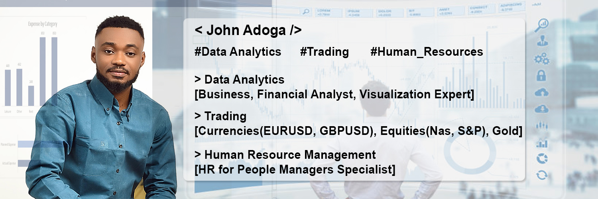

# John Adoga
## Data & Analytics Analyst | Visualization Expert | Business Analyst | Human Resource Manager | HR Analyst

I’m John Adoga from Nigeria, As a seasoned Data Analyst, I have honed my ability to transform raw data into actionable insights. I’m adept at utilizing various tools and methodologies to derive meaningful conclusions that drive business & financial decisions. My proficiency in statistical analysis, predictive modeling, and data visualization ensures that the narratives hidden within numbers are effectively communicated to stakeholders.
My passion for data analytics and Human Resources is further amplified by a specialization in both the Google Data Analytics Professional Certificate and Human Resource Management Specialization, achieved from a comprehensive course conducted by Google and the University of Minnesota on Coursera. This unique blend of data analytics, and HR knowledge equips me with a multifaceted perspective, making me a valuable asset for roles that demand data savvy, analytical depth, and a human-centric approach.

## Skills and Experience 
MICROSOFT OFFICE 365(WORD, POWERPOINT, ADVANCED EXCEL (POWER PIVOT, VLOOKUP)) GOOGLE SHEETS, GOOGLE SLIDES, PYTHON, SQL - DATABASE MANAGEMENT(BIG QUERY, MYSQL, POSTGRE, SSMS), R. 
VISUALIZATION TOOLS - GOOGLE LOCKER STUDIO, POWER BI, TABLEAU

 [!NOTE]
> Bagdes Obtained after completing certifications.

<div data-iframe-width="150" data-iframe-height="270" data-share-badge-id="fdd689cf-35f4-4dc3-ac77-a5435d559dcf" data-share-badge-host="https://www.credly.com"></div><script type="text/javascript" async src="//cdn.credly.com/assets/utilities/embed.js"></script>


<div data-iframe-width="150" data-iframe-height="270" data-share-badge-id="c7e81e1c-e6e7-4b35-af6a-71b8394a04d5" data-share-badge-host="https://www.credly.com"></div><script type="text/javascript" async src="//cdn.credly.com/assets/utilities/embed.js"></script>


<div data-iframe-width="150" data-iframe-height="270" data-share-badge-id="37b74b22-31db-4388-a3b7-01b6419bdc6c" data-share-badge-host="https://www.credly.com"></div><script type="text/javascript" async src="//cdn.credly.com/assets/utilities/embed.js"></script>


- 🔭 I’m currently working on A lot of projects... 
- 🌱 I’m currently learning German 


[](https://github.com/janalytics00)  [](https://www.linkedin.com/in/www.linkedin.com/in/john-adoga-6830071a3/)  [](https://twitter.com/https://twitter.com/JohnAdoga6)  [](https://www.datascienceportfol.io/)  [](https://www.myfxbook.com/portfolio/ode-adoga/8904175)  


[](https://github.com/anuraghazra/github-readme-stats)


## A curated collection showcasing my expertise in data analytics. This portfolio encompasses diverse projects, highlighting my proficiency in data extraction, transformation, visualization, and deriving actionable insights to drive strategic decisions.


# [Project 1: Exploratory Data Analysis Project on Udemy Course Analysis](https://janalytics00.github.io/John_port/Exodus-Cinema-Popcorn-Feedback-Survey)

## Overview of the project 

### Key Components:
- Data cleaning
- Exploratory Data Analysis

### Tools
- Python (Jupyter Notebook)
- Python Libraries used - pandas, seaborn, matplotlib.pyplot

#### Overview:
Delved into 20 analytics questions, uncovering insights that shaped my understanding;

1. Display the Top 10 Rows of the Dataset
2. Check the Last 5 Rows of the Dataset
3. Find Shape of our dataset(Number of rows and Number of Columns)
4. Getting information about our dataset like the total number of rows, the total number of columns, datatypes of each column, and memory Requirements
5. Check Null values in the dataset
6. Check for Duplicate data and drop them
7. Find Out the number of courses per Subject
8. For which levels, Udemy courses providing the courses
9. Display the Count of paid and free courses
10. Which courses has more lectures(free or paid)?
11. Which Courses Have A Higher Number of Subscribers Free or Paid?
12. Which Level Has The Highest Number of Subscribers?
13. Find the Most Popular Course Title
14. Display 10 Most Popular Courses As Per Number of Subscribers
15. Find The Course Which Is Having The Highest Number of Reviews.
16. Does Price Affect the Number of Reviews?
17. Find the Total Number of Courses Related To Python
18. Display 10 Most Popular Python Courses As Per Number of Subscribers
19. In Which Year The Highest Number of Courses Were Posted?


### Link to the Code Notebook
[View here](udemy_courses_analysis.ipynb)


# [Project 2: HR Analytics for Employee Retention](https://janalytics00.github.io/John_port/Data-Cleaning-In-Pandas-Python)

## Overview of the project 

#### Introduction:
Employee retention, therefore, stands as one of the most critical challenges organizations face. High attrition rates can lead to increased training and recruitment costs and a reduction in workforce stability.

To address this challenge, I conducted an HR Analytics project intending to identify factors influencing employee attrition and job satisfaction. In this case study, I will present my findings and actionable recommendations.

#### Problem Statement:
_“As the HR department, we aim to analyze employee attrition within our organization to identify contributing factors and develop strategies to improve retention rates. This analysis will help us make data-driven decisions to foster a more engaged and satisfied workforce. We must identify the key factors contributing to employee attrition and develop effective strategies to enhance employee retention and job satisfaction. By doing so, we aim to create a thriving work environment that not only retains our valuable talent but also attracts new talent, positioning us as an employer of choice in the industry.”_

#### What is Employee Attrition?
Employee attrition happens when an employee leaves an organization, be it for voluntary or involuntary reasons and the replacement does not happen for a long period or sometimes never because let's face it two people can not give the same output. Attrition leads to a decrease in the size of an organization or department as the positions are not filled when the employees leave.
Attrition can occur throughout an entire company or just in certain departments or divisions. This typically happens when automation or new technologies replace employees.

#### Questions to Guide Analysis:
- Are there specific departments or job roles experiencing higher attrition rates?
- What demographic factors, such as age, gender, and education level, correlate with attrition?
- Are there patterns in terms of work-related factors, such as overtime, distance from home, or total working years?
- How do employee satisfaction and engagement relate to attrition?

#### Deliverables:
- Summary of the dataset
- Documentation of cleaning and manipulation of the dataset
- Summary of analysis
- Supporting visuals and key findings
- Recommendations based on analysis

#### Overview
Some interesting code/features worked with
```python
import pandas as pd
import numpy as np
HR = pd.read_csv('HR-Employee-Attrition.csv')
HR.head(5)
```

#### Exploratory Data Analysis:
Plotting a Correlation Map Between all the Numerical Value
```python
import seaborn as sns
import matplotlib.pyplot as plt

# Calculating correlation matrix for all numeric variables
numerical_cols = HR.select_dtypes(include=['int64', 'float64']).columns.tolist()
corr_matrix_all = HR[numerical_cols].corr()

# Plotting the correlation matrix for all numeric variables
plt.figure(figsize=(15, 10))
sns.heatmap(corr_matrix_all, annot=True, fmt='.2f', cmap='coolwarm')
plt.title('Correlation Matrix for All Numeric Variables')
plt.show()
```


#### Insights:
Total working years and job level have a positive correlation with the attrition rate, which means that employees with more experience and higher job levels are much more likely to leave the organization as they have better job opportunities and higher salaries than the less experienced ones.
Monthly rate and salary hike percentage have a less or negative relationship with attrition as employees who are paid well and given a good salary hike are much less likely to leave the organization.
Job involvement and job satisfaction are highly correlated showing that employees who are involved in their job are satisfied with the job.
The job level is also correlated with the Monthly rate, the number of companies worked, and years at the company, suggesting that higher-level employees are more likely to earn higher salaries, have worked at more companies in the past, and have been with the company for longer.

 [!NOTE]
> More Exploratory Analysis in the Notebook. 

#### Link to the Code Notebook
[View here](HR_Analysis (1).ipynb)

#### Recommendations:
Based on our analysis, we propose the following recommendations:

1. Overtime Management:
Implement measures to manage overtime and ensure employees do not become overburdened. Consider providing flexible work options or additional support for those working overtime.

2. Marital Status Awareness:
Understand the needs and concerns of single employees and address factors that may contribute to higher attrition in this group. This could involve offering more inclusive benefits or programs.

3. Education and Training:
Focus on offering opportunities for further education and skill development, especially for employees with lower education levels. This can improve job satisfaction and retention.

4. Commute-Friendly Policies:
Consider policies or benefits to support employees with long commutes, such as remote work options or transportation assistance.

#### Conclusion:
In conclusion, our HR Analytics project uncovered key insights into the factors affecting employee attrition and job satisfaction. With this knowledge, organizations can take proactive measures to enhance employee engagement, reduce turnover, and create a more satisfying work environment.

By implementing the recommended strategies, organizations can foster a positive workplace culture, leading to increased employee retention and ultimately improving overall business performance.


# [Project 2: Data Cleaning In Pandas Python](https://janalytics00.github.io/John_port/Data-Cleaning-In-Pandas-Python)


## Overview of the project 

### Overview:
In today's data-driven world, the ability to clean and preprocess data efficiently is essential for extracting valuable insights and building accurate predictive models. In this guide, I will walk you through data cleaning using Pandas, a powerful Python library for data manipulation and analysis. Whether you're a beginner looking to learn the basics or an experienced data scientist seeking advanced techniques, this guide has something for everyone.

#### The dataset shall be cleaned through the following processes:

1. Checking the number of columns.
2. Changing misspelled column names to correct names.
3. Checking for missing values.
4. Checking for duplicate values.
5. Checking for outliers.


#### - Handling Missing Values:
Identify and handle missing values in your dataset using techniques such as imputation, deletion, or interpolation. Pandas provides functions like isnull(), dropna(), and fillna() for this purpose.

- python code
  
print(df.isnull().sum())  # Check for missing values
df.dropna(inplace=True)  # Drop rows with missing values
df['column'].fillna(df['column'].mean(), inplace=True)  # Impute missing values

#### - Removing Duplicates:
Identify and remove duplicate rows from your dataset using the drop_duplicates() function.

- python code
  
df.drop_duplicates(inplace=True)  # Remove duplicate rows

#### - Data Transformation and Feature Engineering:
Perform data transformation and feature engineering to create new variables or modify existing ones based on domain knowledge or analytical requirements.

- python code
  
df['new_column'] = df['old_column'].apply(lambda x: x * 2)  # Create a new column

#### - Handling Outliers:
Identify and handle outliers in your dataset using techniques such as winsorization or trimming.

- python code
  
from scipy.stats import zscore
df['z_score'] = zscore(df['numeric_column'])
df = df[(df['z_score'] < 3) & (df['z_score'] > -3)]  # Remove outliers


#### Conclusion:
Data cleaning is a crucial step in the data analysis process, and Pandas provides powerful tools to handle various data cleaning tasks efficiently. By following the techniques outlined in this guide, you can prepare your data for further analysis and modeling with confidence. Experiment with different methods and explore advanced Pandas functionalities to tailor your data cleaning process to the specific requirements of your dataset.

### Link to the Code Notebook
[View here](cleaning_data_pandas.ipynb)


# [Project 3: Exploratory Data Analysis of Netflix TV Shows and Movies Dataset](https://janalytics00.github.io/John_port/Exploratory_Data_Analysis_of_Netflix_TV_Shows_and_Movies_Dataset)


## Overview of the project

#### Introduction:
In this portfolio post, I will share insights from an exploratory data analysis (EDA) conducted on the Netflix dataset. This dataset contains information about TV shows and movies available on Netflix until 2021. By analyzing this dataset, we aim to gain insights into the content catalog, trends, and characteristics of Netflix's entertainment offerings.

#### Dataset Description:
The Netflix dataset comprises several features, including:

- Title: The title of the TV show or movie.
- Type: Indicates whether the entry is a movie or TV show.
- Director: The director(s) of the content.
- Cast: The cast members featured in the content.
- Country: The country where the content was produced.
- Release Year: The year of release.
- Rating: The content rating (e.g., TV-MA, PG-13, etc.).
- Duration: The duration of the content (in minutes for movies, in seasons for TV shows).
- Listed in: Genres or categories the content is listed under.
- Exploratory Data Analysis:

#### Data Cleaning and Preprocessing:

- Loaded the dataset and inspected its structure.
- Checked for missing values and handled them appropriately.
- Converted data types as needed.

#### Understanding the Dataset:

Explored the distribution of content types (movies vs. TV shows).
Examined the distribution of release years to identify trends over time.
Analyzed the top countries contributing to Netflix content.

#### Content Analysis:

- Show all the Records, where, "Category is Movie and Type is Comedies" or "Country is United Kingdom"
- In how many movies/shows, Tom Cruise was cast?
- What are the different Ratings defined by Netflix?
- How many TV Show got the 'R' rating, after year 2018?
- What is the maximum duration of a Movie/Show on Netflix?
- Which individual country has the Highest No. of TV Shows?
- And More in the notebook, link below

#### Duration Analysis:
Examined the distribution of movie durations.
Investigated the distribution of TV show seasons.

#### Visualizations:
Created visualizations, including bar plots, pie charts, and histograms, to illustrate key findings.
Used seaborn and matplotlib libraries for visualization.

#### Insights and Observations:

- The dataset primarily consists of movies, with a smaller proportion of TV shows.
- Netflix has been consistently expanding its content library over the years, with a significant increase in content production observed in recent years.
- The United States and India are among the top contributors to Netflix content.
- Drama, Comedy, and Documentary are the most prevalent genres on Netflix.
- Most movies have a duration of around 90-120 minutes, while TV shows typically have 1-2 seasons.

#### Conclusion:

Through this exploratory data analysis, we gained valuable insights into the Netflix content catalog, including trends, popular genres, and content characteristics. These insights can inform content creation strategies, audience targeting, and content recommendation algorithms, contributing to a better understanding of Netflix's position in the entertainment industry.

### Link to the Code Notebook
[View here](Netflix_Dataset_Analysis.ipynb)


# [Project 4: Exodus Cinema Popcorn Feedback Survey](https://janalytics00.github.io/John_port/Exodus-Cinema-Popcorn-Feedback-Survey)

Overview:
Undertook a comprehensive survey project for Exodus Cinemas aimed at gathering customer feedback regarding the popcorn served at the venue. The primary objective was to understand customer preferences, identify areas of improvement, and align the popcorn quality and variety with audience expectations.

Key Components:

Survey Design: Crafted a set of strategic questions that delved into aspects like taste, freshness, portion size, variety, and price of the popcorn.
Data Collection: Employed both digital and on-site survey methods to capture a diverse range of audience feedback.
Data Analysis: Analyzed the collected data to identify prevailing trends, satisfaction levels, and areas needing attention.
Recommendations: Based on the analysis, provide actionable recommendations to enhance the popcorn's quality, introduce new flavors, adjust pricing, or modify serving sizes.

## Overview of the project 


# [Project 5: Microsoft SQL Meets Power BI Magic!](https://janalytics00.github.io/John_port/Microsoft-SQL-Meets-Power-BI-Magic)

Overview:
Recently, I embarked on an intricate data analysis project upon a request from Sales Manager Steve.
### Overview 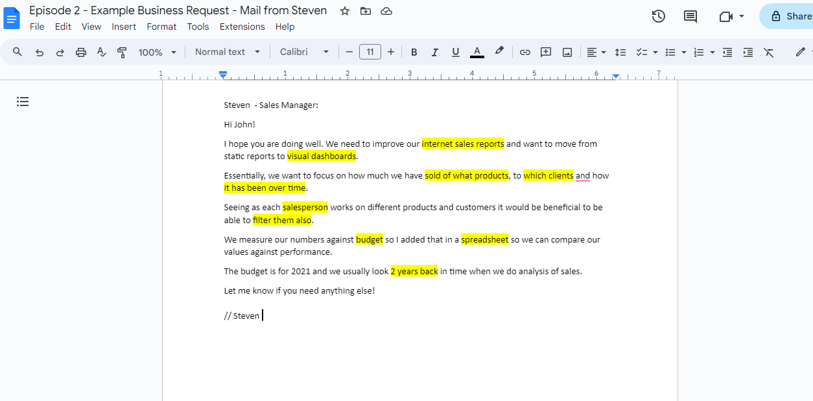

With attention to detail, I arranged a comprehensive outline based on Steve's needs for his company. Which will serve as a framework for my analysis
## Overview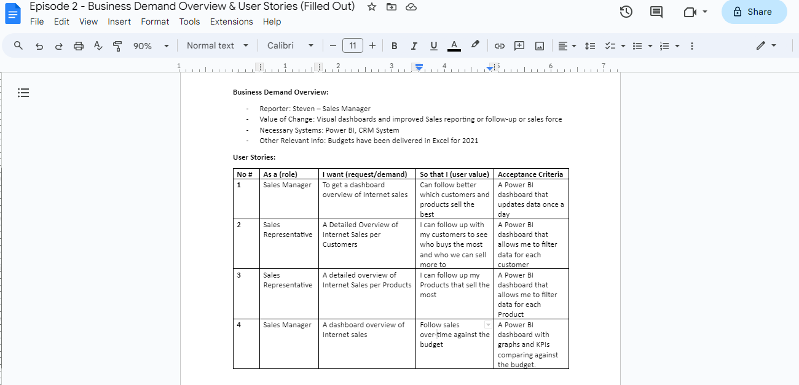

## Data Cleansing & Transformation utilizing Microsoft SQL
From the get-go, the database presented multiple challenges. With precision, I cleaned and processed the data using Microsoft SQL, ensuring relevant tables were seamlessly joined to extract the information we needed. I then converted the cleansed data into CSV formats for visualization prowess.
## Overview 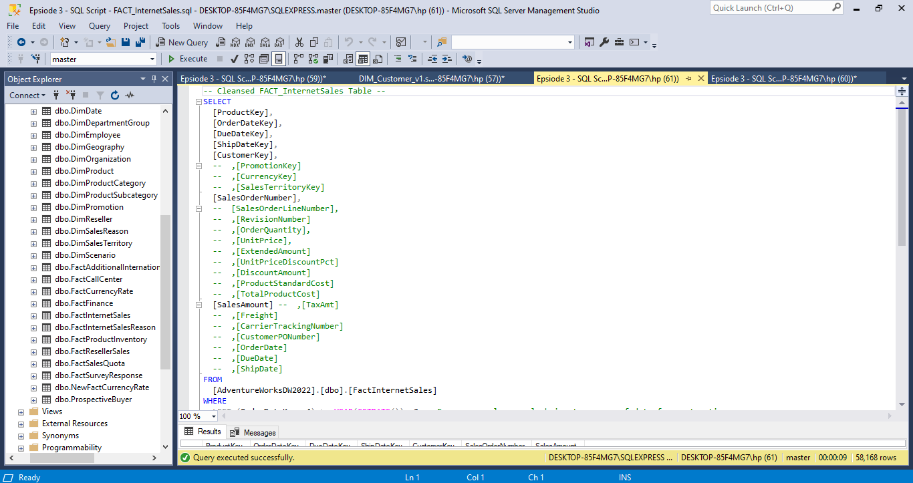
## Overview 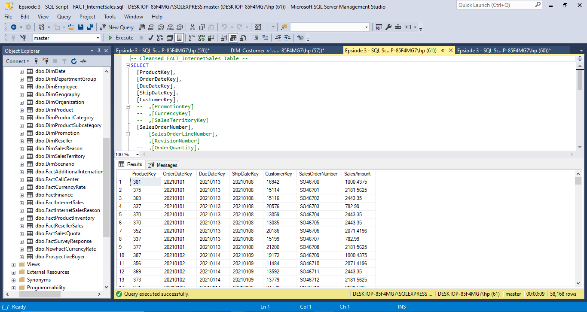
## Overview 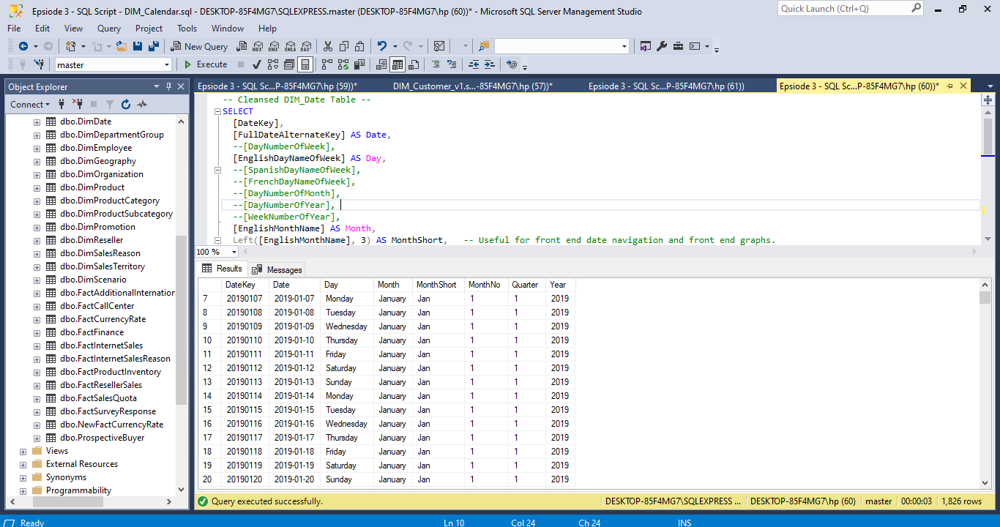


Using Power BI, I crafted vivid visuals for sales, customer, and product reports. Highlights include:

Geographical insights pinpointing high-sales locations 📍
Rankings of top-performing customers and products 🌟
Comprehensive line charts offering a 2-year company performance overview 📈
The end result? Clear, data-driven insights that inform and inspire. It's amazing how SQL combined with Power BI's visualization can transform raw data into actionable strategies! Swipe to see some of the visuals! 👉 #DataAnalysis #SQL #PowerBI #PortfolioProject"
Be
## Power BI Data Model
## Overview 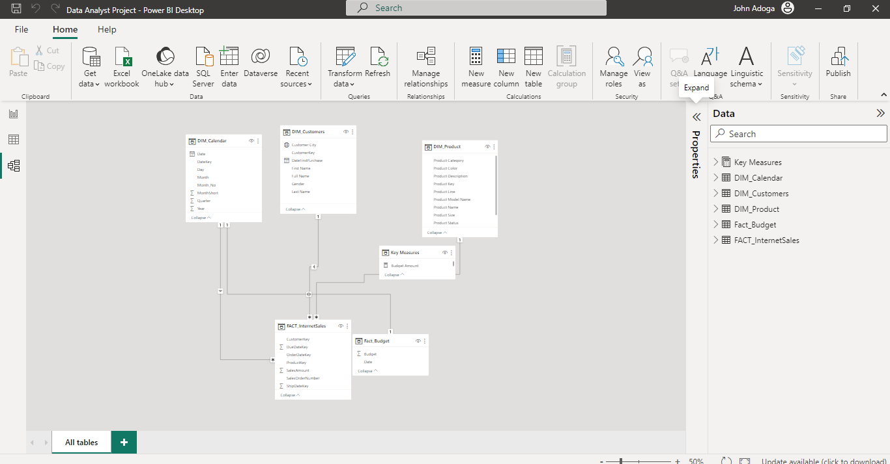

## Customer Details
The cherry on top? An interactive dashboard is accessible via this PowerBI embed link. Dive in to interact and explore deeper insights! Feedback welcomed! #DataAnalysis #SQL #PowerBI #DataVisualization"
<iframe title="Data Analyst Project" width="600" height="373.5" src="https://app.powerbi.com/view?r=eyJrIjoiMzY1OGIyMDgtM2NhMC00Zjk0LWE0NzItMGFiN2FmMDE1NjVkIiwidCI6ImE2ZjAzODUwLThiMDEtNDA0Yi1iM2NlLWFjNWNiODY0YjY3NiJ9" frameborder="0" allowFullScreen="true"></iframe>

## Sales Details
## Overview 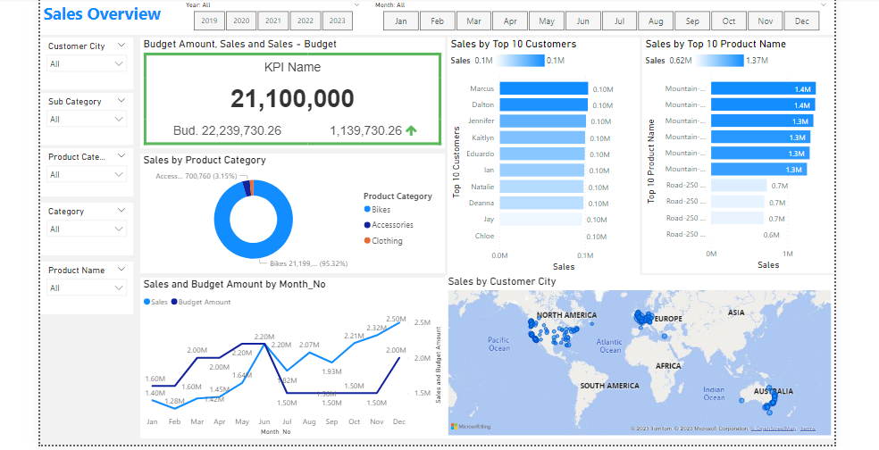

🖥️ With Power BI, I sculpted immersive visuals, focusing on sales metrics, customer trends, and product performance. Key insights:
1. Geospatial mapping of sales-dense locations 🌍
2. Leaderboards of our star customers and stellar products ⭐
3. Evolving line charts capturing a 2-year performance trajectory 📈
## Product Details
## Overview 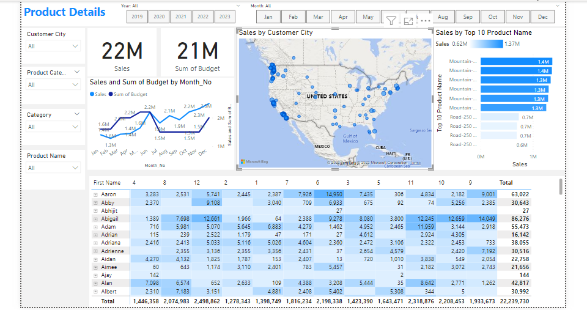
## LinkedIn Embed
<iframe src="https://www.linkedin.com/embed/feed/update/urn:li:ugcPost:7119132656189026304?compact=1" height="399" width="710" frameborder="0" allowfullscreen="" title="Embedded post"></iframe>


# [Project 6: Adidas US Interactive Sales Dashboard](https://janalytics00.github.io/John_port/Adidas-US-Interactive-Sales-Dashboard)

Overview:
Designed and developed an interactive sales dashboard focused on Adidas US market performance. This dynamic tool visualizes real-time sales data, highlighting key metrics like regional sales, top-performing products, and monthly trends. By incorporating user-responsive features, stakeholders can easily customize views, allowing for intuitive, data-driven decision-making. The dashboard offers a cohesive snapshot of Adidas' market positioning and areas of growth, serving as an invaluable tool for strategists and marketers.

## Overview of the project 


# [Project 7: A Bike Sales Dashboard crafted in Excel!]([https://janalytics00.github.io/John_port/Adidas-US-Interactive-Sales-Dashboard](https://www.linkedin.com/posts/john-adoga-6830071a3_dataanalytics-exceldashboard-bikesalesanalysis-activity-7112398062555213824-aNix?utm_source=share&utm_medium=member_desktop))


🚴‍♂️ Exciting Project Alert! 📊

Delighted to share my latest creation: A Bike Sales Dashboard crafted in Excel! This interactive tool provides a deep dive into bike sales across regions - Europe, North America, and the Pacific. But what makes it even more intriguing is the layering of data by educational qualification, age ranges, and marital status. Ever wondered who's pedaling more, singles or married folks? Or which age bracket is the most bicycle-inclined?

With this dashboard, you can visualize these trends at a glance! Proud of this endeavor, as it not only hones my analytical skills but also offers invaluable insights for targeted marketing and sales strategies.

Would love to hear your feedback and thoughts! Let's pedal forward with data-driven insights. 🚴‍♀️📈

## Overview of the project 
<iframe src="https://www.linkedin.com/embed/feed/update/urn:li:ugcPost:7112397816269828097" height="787" width="504" frameborder="0" allowfullscreen="" title="Embedded post"></iframe>


# [Project 8: Data cleaning in Excel and Google Sheets](https://janalytics00.github.io/John_port/Data-Cleaning-In-Excel-And-Google-Sheets)

Overview:
I Engaged in a comprehensive data cleaning initiative utilizing both Excel and Google Sheets to enhance the quality and integrity of a significant dataset. The project entailed identifying and rectifying discrepancies, missing values, and potential outliers, ensuring consistency and uniformity across.

## Overview of the project Before 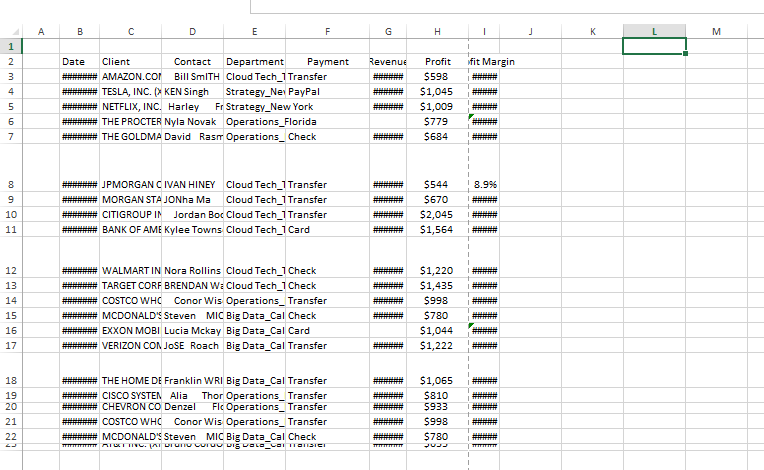 

## Overview of the project After 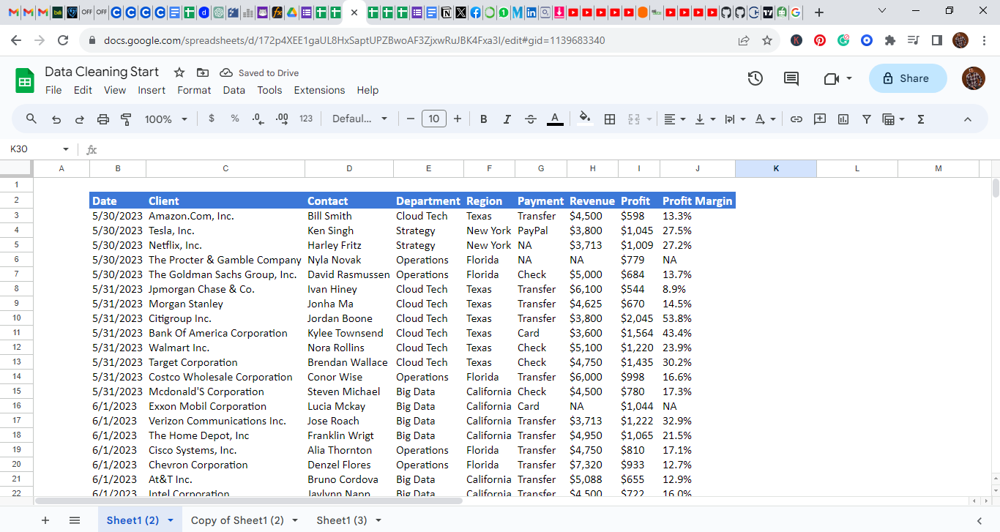 


# [Project 6: South American Sales Dashboard (2021-2022)](https://janalytics00.github.io/John_port/South-American-Sales-Dashboard-2021-2022)

This dashboard offers a dynamic visual representation of sales trends in South America. Crafted with meticulous attention to detail, it boasts interactive elements, hyperlinks for in-depth external resources, and internal navigational links to enhance user experience.

A deep dive into the data reveals a promising sales trajectory. The latter half of 2021 saw a surge in sales, a momentum which carried over into the first quarter of 2022, showcasing the effectiveness of end-of-year strategies and campaigns. December 2022, in particular, stood out as a pivotal sales month.

Beyond sales, the dashboard paints a vivid picture of customer satisfaction metrics:

Availability: A commendable rating of over 95%, highlighting the brand's consistent presence in the market.
Hygiene: Impressive feedback with a score of 93%, underlining the commitment to health and safety standards.
Service: A potential area for improvement, currently rated at 53%, suggesting scope for enhancing customer service operations.
Quality: With a rating of 86%, it is evident that product excellence remains a top priority.
From a financial perspective, the dashboard indicates stellar performance with overall sales of 2,544 units and an impressive profit margin, netting a total of $890M.

## Overview of the project After  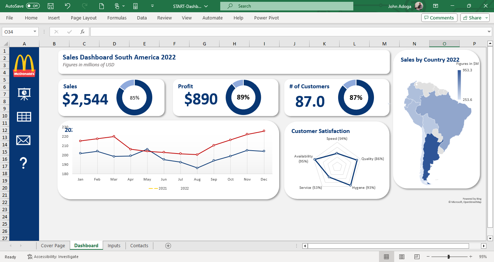

Below is the LinkedIn embed!

<iframe src="https://www.linkedin.com/embed/feed/update/urn:li:ugcPost:7112885235129708544?compact=1" height="399" width="710" frameborder="0" allowfullscreen="" title="Embedded post"></iframe>


# [Project 7: Coca-Cola Power BI Dashboard: A Blend of Data & AI](https://janalytics00.github.io/John_port/Coca-Cola-Power-BI-Dashboard-A-Blend-of-Data-&-AI)

I had the pleasure of transforming an Excel workbook for Coca-Cola into a dynamic Power BI Dashboard. Key features:

🔍 AI-Powered Q&A: Dive into insights effortlessly. Pose questions like "best-selling state" and let the AI work its magic.
💡 Operating Profit Analysis: Leveraged 'Key Influencers', a potent AI visualization in Power BI, for a deeper dive into the factors driving profits.
📅 Interactive Date Slicer: Sales data come alive with a flexible timeline slicer, letting users navigate across different periods with ease.
... and many more interactive elements, ensuring a comprehensive view of sales data and analytics.

 ## Overview of the project: 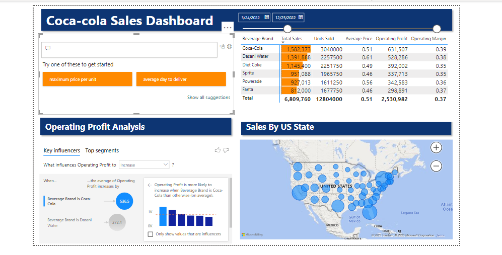
 
 Below is the LinkedIn embed!
 
 <iframe src="https://www.linkedin.com/embed/feed/update/urn:li:ugcPost:7113289116561108993?compact=1" height="399" width="710" frameborder="0" allowfullscreen="" title="Embedded post"></iframe>
 
 

# [Project 8: HR Dashboard: In-depth Analysis of Employee Demographics and Status](https://janalytics00.github.io/John_port/HR-Dashboard-In-depth-Analysis-of-Employee-Demographics-and-Status)

## In my recent project, I developed a comprehensive HR dashboard providing key insights into a company's workforce dynamics. The dashboard offers:

Scorecard Metrics:

Total employee count with a breakdown by gender.
Detailed figures on employees due for promotion, contrasted with those not in the current promotion cycle.
Service Year Insights: A horizontal bar chart maps out employee tenure, highlighting their loyalty and experience spread.

Employee Job Levels: A vertical bar chart offers a visual breakdown of employees by their job levels, providing a quick overview of the company's hierarchical distribution.

Employee Status Overview: A scorecard displaying the ratio of active employees to those retrenched, offering insights into the company's recent HR moves.

Distance Status Analytics: A donut pie chart depicts the commuting ease for employees, with a significant 63.96% living 'very close' to the workplace.

This dashboard serves as an analytical tool for HR professionals to make informed decisions, track demographic shifts, and plan future HR strategies effectively.

## Overview: 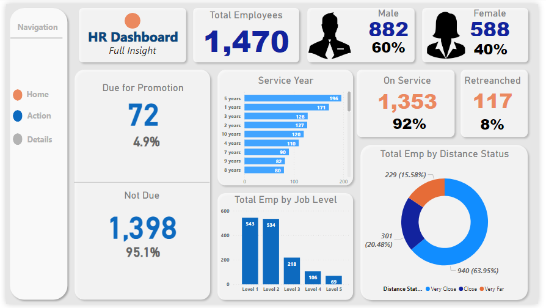

A comprehensive table listing each employee slated for promotion, ensuring transparency and traceability.
A distinct table spotlighting employees who are unfortunately on the retrenchment list, aiding HR in transition and support processes.
This multifaceted dashboard serves as a powerful tool for HR professionals. By offering both broad statistics and individualized data, it facilitates strategic planning, transparent communication, and efficient decision-making within the human resources domain.

## Overview: 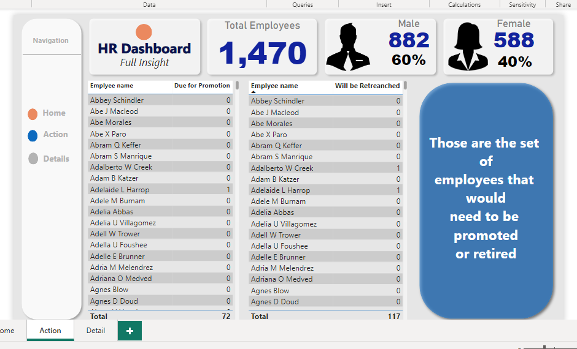

A holistic view of the total employee count, segregated by gender.
Clear and precise metrics detailing the percentage and number of employees in the promotion pipeline and those who aren't.
Departmental Promotions Insight:

A stacked bar chart that vividly displays each department alongside the number of employees therein who are due for promotion. This provides a panoramic view of where career advancements are clustered within the company.
Job Satisfaction Metrics:

A bar chart that offers a snapshot of employee morale and satisfaction. The data overwhelmingly indicates a satisfied workforce, underscoring a healthy organizational culture.

## Overview: 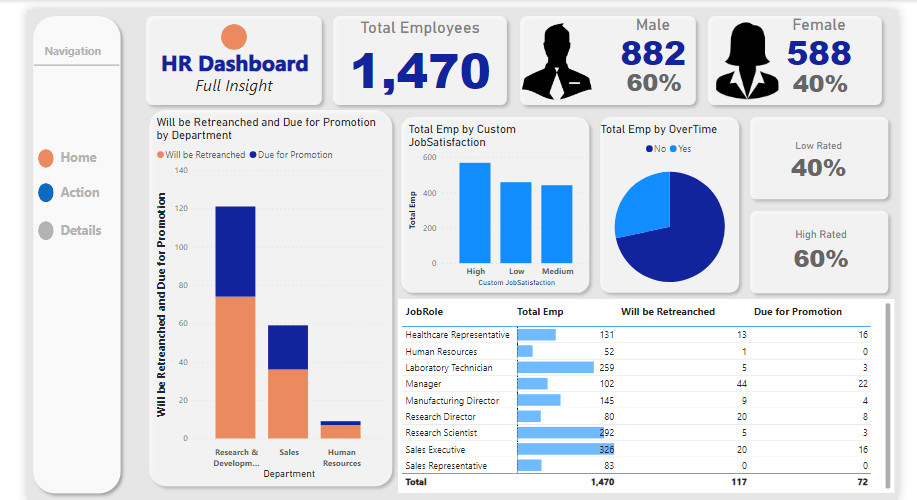

## LinkedIn Embed Below

<iframe src="https://www.linkedin.com/embed/feed/update/urn:li:ugcPost:7115117175379496960" height="undefined" width="504" frameborder="0" allowfullscreen="" title="Embedded post"></iframe>
