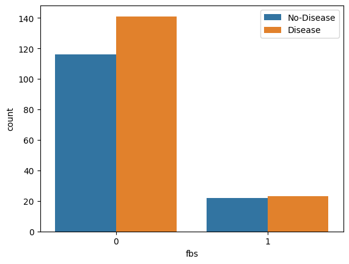
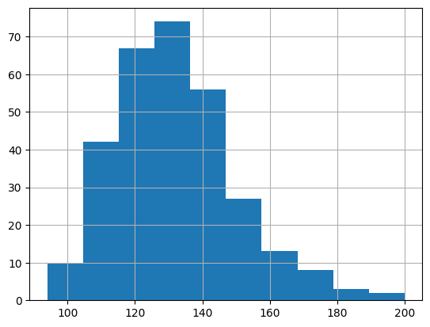
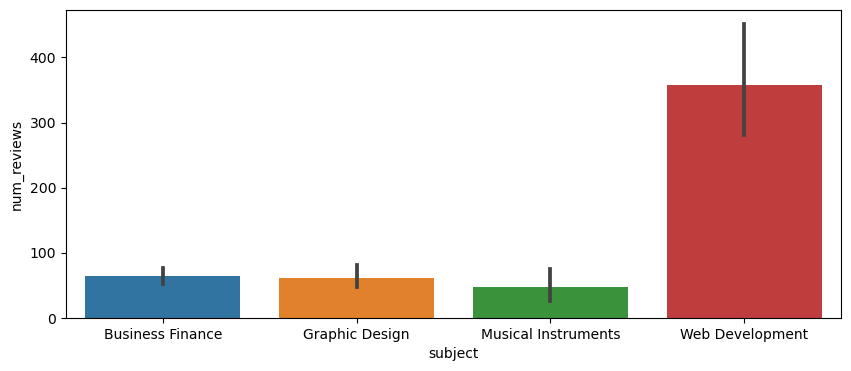
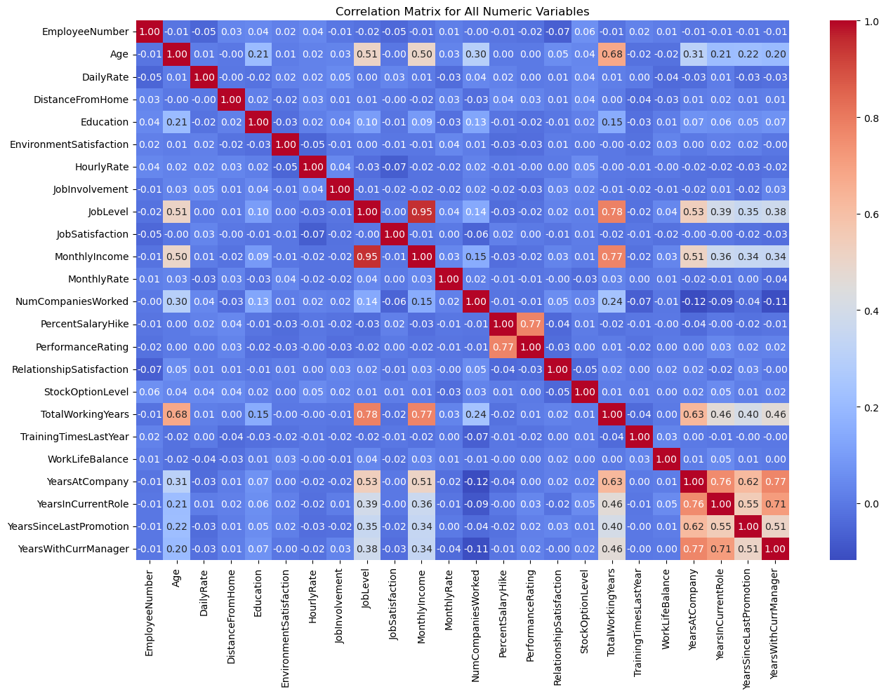
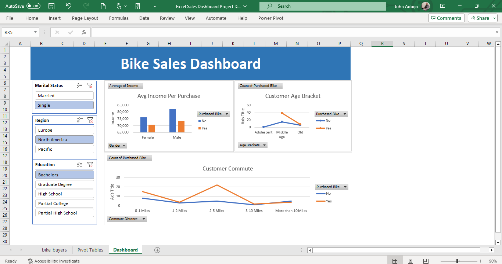

# John Adoga
## Data & Analytics Analyst | Visualization Expert | Business Analyst | Human Resource Manager | HR Analyst

I’m John Adoga from Nigeria, As a seasoned Data Analyst, I have honed my ability to transform raw data into actionable insights. I’m adept at utilizing various tools and methodologies to derive meaningful conclusions that drive business & financial decisions. My proficiency in statistical analysis, predictive modeling, and data visualization ensures that the narratives hidden within numbers are effectively communicated to stakeholders.
My passion for data analytics and Human Resources is further amplified by a specialization in both the Google Data Analytics Professional Certificate and Human Resource Management Specialization, achieved from a comprehensive course conducted by Google and the University of Minnesota on Coursera. This unique blend of data analytics, and HR knowledge equips me with a multifaceted perspective, making me a valuable asset for roles that demand data savvy, analytical depth, and a human-centric approach.

## Skills and Experience 
MICROSOFT OFFICE 365(WORD, POWERPOINT, ADVANCED EXCEL (POWER PIVOT, VLOOKUP)) GOOGLE SHEETS, GOOGLE SLIDES, PYTHON, SQL - DATABASE MANAGEMENT(BIG QUERY, MYSQL, POSTGRE, SSMS), R. 
VISUALIZATION TOOLS - GOOGLE LOCKER STUDIO, POWER BI, TABLEAU

> [!NOTE]
> Bagdes Obtained after completing certifications.

<div data-iframe-width="150" data-iframe-height="270" data-share-badge-id="fdd689cf-35f4-4dc3-ac77-a5435d559dcf" data-share-badge-host="https://www.credly.com"></div><script type="text/javascript" async src="//cdn.credly.com/assets/utilities/embed.js"></script>


<div data-iframe-width="150" data-iframe-height="270" data-share-badge-id="c7e81e1c-e6e7-4b35-af6a-71b8394a04d5" data-share-badge-host="https://www.credly.com"></div><script type="text/javascript" async src="//cdn.credly.com/assets/utilities/embed.js"></script>


<div data-iframe-width="150" data-iframe-height="270" data-share-badge-id="37b74b22-31db-4388-a3b7-01b6419bdc6c" data-share-badge-host="https://www.credly.com"></div><script type="text/javascript" async src="//cdn.credly.com/assets/utilities/embed.js"></script>


<div data-iframe-width="150" data-iframe-height="270" data-share-badge-id="e7708d6e-8c71-4c74-934f-f05ffb62c849" data-share-badge-host="https://www.credly.com"></div><script type="text/javascript" async src="//cdn.credly.com/assets/utilities/embed.js"></script>

### Human Resource Management: HR for People Managers by the University of Minnesota on Coursera. Certificate earned on February 13, 2024
[View Here](https://coursera.org/share/19c04c6b788194f965970aad1f600e48)


- 🔭 I’m currently working on A lot of projects... 
- 🌱 I’m currently learning German 


[](https://github.com/janalytics00)  [](https://www.linkedin.com/in/www.linkedin.com/in/john-adoga-6830071a3/)  [](https://twitter.com/https://twitter.com/JohnAdoga6)  [](https://www.datascienceportfol.io/)  [](https://www.myfxbook.com/portfolio/ode-adoga/8904175)  


[](https://github.com/anuraghazra/github-readme-stats)


## A curated collection showcasing my expertise in data analytics. This portfolio encompasses diverse projects, highlighting my proficiency in data extraction, transformation, visualization, and deriving actionable insights to drive strategic decisions.


# [Project 1: Bank Customer Churn Prediction](https://janalytics00.github.io/John_port/Bank-Customer-Churn-Prediction)

### Overview 


In the banking industry, it is important to predict and understand when customers might decide to end their relationship with the bank, known as customer churn. When customers leave, it can lead to financial losses and impact the bank's reputation. By identifying customers who are likely to churn, the bank can proactively take measures to retain them and minimize revenue loss. Therefore, the goal of this project is to develop a system that can accurately predict customer churn to take proactive steps to retain these customers.

### Data
The data used in this project is from Kaggle
[View here](assest/Bank Customer Churn Prediction Using ML/Churn_Modelling.csv)

### Data Exploration and Cleaning
Checking for Null Values in the dataset
```python
data.isnull().sum()

```

### Modelling

Different models were evaluated and the best-performing model was picked to be the final model. Precision was used as the main evaluation metric to avoid wasting resources on customers who would not have churned. The Random Forest Classifier was picked as the final model, with its parameters being the best parameters found through grid search.

``` python
final_data = pd.DataFrame({'Models':['LR','SVC','KNN','DT','RT','GBC'],
                           'ACC':[accuracy_score(y_test, y_predl),
                                 accuracy_score(y_test, y_pred2),
                                 accuracy_score(y_test, y_pred3),
                                 accuracy_score(y_test, y_pred4),
                                 accuracy_score(y_test, y_pred5),
                                 accuracy_score(y_test, y_pred6),]})
final_data
```


### Conclusion

The accuracy score of the model is 86%. That means that the model predicts whether a customer will churn or not 86% of the time. By leveraging the predictive power of the model, the bank can proactively take actions to prevent customer churn and improve overall customer retention rates. By focusing resources on customers identified as likely to churn, the bank can implement targeted retention strategies, such as personalized offers, improved customer service, or loyalty programs, to keep these customers engaged and satisfied. Ultimately, this approach can help the bank optimize its retention efforts and minimize customer churn.

### Limitations

- Data availability: The accuracy of the churn prediction model depends on the quality and availability of historical customer data.
- Changing factors: The factors that contribute to customer churn can evolve over time. Therefore, the churn prediction model requires regular maintenance.
- External factors: The model may not account for external factors such as economic conditions, regulatory changes, or competitive landscape, which can influence customer churn. These factors should be considered when interpreting the predictions and implementing retention strategies.

### Recommendations

- Personalized retention campaigns: Tailor marketing and promotional offers to meet the specific needs and preferences of customers who are at risk of leaving. By providing targeted incentives and solutions, the bank can encourage these customers to stay.

- Improve customer service: Enhance the overall customer experience by ensuring prompt and efficient support, addressing customer complaints effectively, and offering proactive assistance. By providing exceptional service, the bank can strengthen customer loyalty and reduce the likelihood of churn.

- Foster customer loyalty programs: Introduce loyalty programs, rewards, and exclusive benefits for long-standing customers. By offering incentives for continued engagement, the bank can encourage customers to remain loyal and reduce the temptation to switch to competitors.

#### Python notebook [Link](assest/Bank Customer Churn Prediction Using ML/bank_customer_churn_prediction.ipynb)


# [Project 2: Heart Disease Analysis](https://janalytics00.github.io/John_port/Heart_Disease_Analysis)


### Overview

Thus preventing Heart disease has become more than necessary. Good data-driven systems for predicting heart diseases can improve the entire research and prevention process, making sure that more people can live healthy lives. This is where Machine Learning comes into play. Machine Learning helps in predicting Heart diseases, and the predictions made are quite accurate.

The project involved analysis of the heart disease patient dataset with proper data processing. Then, different models were trained and predictions were made with different algorithms KNN, Decision Tree, Random Forest, SVM, Logistic Regression, etc This is the Jupyter Notebook code and dataset I've used for my Kaggle kernel 'Binary Classification with Sklearn and Keras'

I've used a variety of Machine Learning algorithms, implemented in Python, to predict the presence of heart disease in a patient. This is a classification problem, with input features as a variety of parameters, and the target variable as a binary variable, predicting whether heart disease is present or not.

#### Exploring the Dataset to find the following:

1. Count of Male & Female in this Dataset

``` python
sns.histplot(data['sex'])
plt.show()
```


2. Gender Distribution According to The Target Variable

``` python
sns.countplot(x='sex', hue="target", data=data)
plt.xticks([1,0], ['Male','Female'])
plt.legend(labels=['No-Disease','Disease'])
plt.show()
```


``` python
sns.displot(data['age'], bins=20)
plt.show()
```

3. Age Distribution In The Dataset

``` python
sns.countplot(x='sex', hue="target", data=data)
plt.xticks([1,0], ['Male','Female'])
plt.legend(labels=['No-Disease','Disease'])
plt.show()
```


4. Check Chest Pain Type

chest pain type (4 values)
- Value 0: typical angina
- Value 1: atypical angina
- Value 2: non-anginal pain
- Value 3: asymptomatic
``` python
# Create a countplot
plt.bar(data['cp'].value_counts().index, data['cp'].value_counts())
```

``` python
# Set the tick labels and rotate them
plt.xticks([0,1,2,3], ["typical angina","atypical angina","non-anginal pain","asymptomatic"], rotation=75)
```

``` python
# Add labels and title
plt.xlabel('Chest Pain Type')
plt.ylabel('Count')
plt.title('Distribution of Chest Pain Type')
```


``` python
# Show plot
plt.show()
```


5. Show The Chest Pain Distribution As Per Target Variable
``` python
sns.countplot(x="cp", hue="target", data=data)
plt.legend(labels=["No-Disease","Disease"])
plt.show()
```


6. Fasting Blood Sugar Distribution According To Target Variable

``` python
# fbs: (fasting blood sugar > 120 mg/dl) (1 = true; 0 = false)
sns.countplot(x="fbs", hue="target", data=data)
plt.legend(labels=["No-Disease","Disease"])
plt.show()
```


7. Resting Blood Pressure Distribution
``` python
data['trestbps'].hist()
```


8. Resting Blood Pressure As Per Sex Column
``` python
g = sns.FacetGrid(data, hue="sex", aspect=3)
g.map(sns.kdeplot,'trestbps', fill=True)
plt.legend(labels=['Male', 'Female'])
```


9. Plot Continuous Variables
``` python
data.columns
```
``` python
cate_val = []
cont_val=[]

for column in data.columns:
  if data[column].nunique() <=10:
    cate_val.append(column)
  else:
    cont_val.append(column)
```
``` python
cate_val
```
``` python
cont_val
```
``` python
data.hist(cont_val, figsize=(15,6))
plt.tight_layout()
plt.show()
```


#### Dataset used [Link](assest/Heart Disease Analysis/heart.csv)

# [Project 3: Wine Quality Prediction using Machine Learning](https://janalytics00.github.io/John_port/Wine-Quality-Prediction-using-Machine-Learning)


### Overview
For this project, I used Kaggle’s Red Wine Quality dataset to build various classification models to predict whether a particular red wine is “good quality” or not. Each wine in this dataset is given a “quality” score between 0 and 10. For this project, I converted the output to a binary output where each wine is either “good quality” (a score of 7 or higher) or not (a score below 7). The quality of a wine is determined by 11 input variables:

- Fixed acidity
- Volatile acidity
- Citric acid
- Residual sugar
- Chlorides
- Free sulfur dioxide
- Total sulfur dioxide
- Density
- pH
- Sulfates
- Alcohol

1. Quality Vs. Fixed Acidity

``` python
plt.bar(data['quality'], data['fixed acidity'])
plt.xlabel('Quality')
plt.ylabel('Fixed acidity')
plt
```


2. Volatile Acidity Vs. Quality

``` python
plt.bar(data['quality'], data['volatile acidity'])
plt.xlabel('Quality')
plt.ylabel('volatile acidity')
plt
```


3. Residual sugar Vs. Quality

``` python
plt.bar(data['quality'], data['residual sugar'])
plt.xlabel('Quality')
plt.ylabel('Residual sugar')
plt
```


4. Chlorides Vs. Quality

``` python
plt.bar(data['quality'], data['chlorides'])
plt.xlabel('Quality')
plt.ylabel('Chlorides')
plt.show()
```


5. Total sulfur dioxide Vs. Quality

``` python
plt.bar(data['quality'], data['total sulfur dioxide'])
plt.xlabel('Quality')
plt.ylabel('Total sulfur dioxide')
plt.show()
```


6. Alcohol Vs. Quality

``` python
plt.bar(data['quality'], data['alcohol'])
plt.xlabel('Quality')
plt.ylabel('Alcohol')
plt.show()
```


7. Correlation Matrix

``` python
plt.figure(figsize=(10,5))
sns.heatmap(data.corr(), annot=True,fmt='0.1f')
```


8. Binarization of target variable

``` python
data['quality'].unique()
```
``` python
data['quality'] = [1 if x>=7 else 0 for x in data['quality']]
```
``` python
data['quality'].unique()
```

9. Splitting The Dataset Into the Training Set and Test Set

``` python
from sklearn.model_selection import train_test_split

X_train, X_test, y_train, y_test = train_test_split(X_res, y_res, test_size=0.20, random_state=42)
```
10. Feature Scaling

``` python
from sklearn.preprocessing import StandardScaler

st = StandardScaler()
X_train = st.fit_transform(X_train)
X_test = st.transform(X_test)

X_train
```
11. Logistic Regression

``` python
from sklearn.linear_model import LogisticRegression

log = LogisticRegression()
log.fit(X_train, y_train)

y_pred1 = log.predict(X_test)

from sklearn.metrics import accuracy_score

accuracy_score(y_test, y_pred1)

from sklearn.metrics import precision_score, recall_score,f1_score

precision_score(y_test, y_pred1)

precision_score(y_test, y_pred1)

recall_score(y_test, y_pred1)

f1_score(y_test, y_pred1)
```
``` python
final_data = pd.DataFrame({'Models':['LR', 'SVC','KNN','DT','RF','GBC'],
              'ACC':[accuracy_score(y_test,y_pred1)*100,
                    accuracy_score(y_test,y_pred2)*100,
                    accuracy_score(y_test,y_pred3)*100,
                    accuracy_score(y_test,y_pred4)*100,
                    accuracy_score(y_test,y_pred5)*100,
                    accuracy_score(y_test,y_pred6)*100]})
```
``` python
import seaborn as sns
import matplotlib.pyplot as plt

# Assuming final_data is a DataFrame with 'Models' and 'ACC' columns
sns.barplot(x='Models', y='ACC', data=final_data)

plt.xlabel('Quality')
plt.ylabel('ACC')
plt.title('ACC by Model')
plt.show()
```


#### Python Notebook [Link](assest/Wine Quality Prediction/wine_quality_prediction.ipynb)

#### Link to the data file
[View here](assest/Wine Quality Prediction/winequality-red.csv)


# [Project 4: Google Play Store Business Problem Statement](https://janalytics00.github.io/John_port/Google-play-store-Business-Problem-Statement)

### Business Problem Statement:
The goal is to analyze the Google Play Store Apps dataset to derive insights into the app market. We aim to understand the factors that contribute to an app's success, including its user ratings, reviews, and category. We want to explore user sentiments towards apps by analyzing the user reviews dataset. Additionally, we can see insights into the popularity of app categories based on the total number of installs and the sentiment polarity of user reviews. The ultimate objective is to provide recommendations for app developers to enhance their app's performance and user satisfaction.

### Overview of the project 

### Overview of dataset:
 Provide the overview of dataset by how many total unique apps and categories are in our dataset.
```sql
-- how many total unique apps and categories in our dataset.
SELECT 
	COUNT(DISTINCT App) AS total_apps,
	COUNT(DISTINCT Category) AS total_categories
FROM dbo.googleplaystore
```


Explore App Categories and Counts:
 Retrieve the unique app categories and the count of apps in each category.
```sql
-- Retrieve the unique app categories and the count of apps in each category.
SELECT TOP 5
	Category,
	COUNT(App) AS Total_app
FROM dbo.googleplaystore
GROUP BY  Category
ORDER BY Total_app DESC
```


Top-rated Free Apps:
 Identify the top-rated free apps.
```sql
-- Identify the top-rated free apps.
SELECT TOP 10
App,
Category,
Rating,
Reviews
FROM dbo.googleplaystore
WHERE Type = 'Free' AND Rating <> 'NaN'
ORDER BY Rating DESC
```


Most Reviewed Apps:
 Find the apps with the highest number of reviews.
```sql
-- Find the apps with the highest number of reviews.
SELECT TOP 20
Category,
App,
Reviews
FROM dbo.googleplaystore
ORDER BY Reviews DESC
```


Average Rating by Category:
 Calculate the average rating for each app category.
Top Categories by Number of Installs:
 Identify the app categories with the highest total number of installs.
```sql
-- Identify the app categories with the highest total number of installs.
SELECT TOP 10
Category,
SUM(CAST(REPLACE(SUBSTRING(Installs, 1, PATINDEX('%[^0-9]%', installs + ' ') - 1), ',', ' ') AS INT)) as total_installs
FROM dbo.googleplaystore
GROUP BY Category
ORDER BY total_installs DESC
```


Average Sentiment Polarity by App Category:
 Analyze the average sentiment polarity of user reviews for each app category.

<iframe title="Google play store" width="600" height="373.5" src="https://app.powerbi.com/view?r=eyJrIjoiYzRiZDQwYmItNzRiZC00NDkzLWJkMGEtOTJiOTcxMzk4ZWNlIiwidCI6ImE2ZjAzODUwLThiMDEtNDA0Yi1iM2NlLWFjNWNiODY0YjY3NiJ9" frameborder="0" allowFullScreen="true"></iframe>


# [Project 5: IBM HR Analytics Employee Attrition & Performance](https://janalytics00.github.io/John_port/IBM-HR-Analytics-Employee Attrition-&-Performance)

### Overview of the project 

### Context 
This is a fictional data set created by IBM data scientists.

### KPIs
Gained insights into the dataset using the following KPI from the data
- Employees by Age
- Employees by Gender
- Employees by Hourly rate
- Employees by Job role
- Employees by Department
- Employees by the Educational field
- Employees by Business travel

### Link to the data file
[View here](assest/IBM data.csv)


<iframe title="IBM HR Analysis" width="600" height="373.5" src="https://app.powerbi.com/view?r=eyJrIjoiOTI1NjI3ZmQtMzA0Zi00M2FmLTg1MDUtNTNlMGM1ZTI0ZWFkIiwidCI6ImE2ZjAzODUwLThiMDEtNDA0Yi1iM2NlLWFjNWNiODY0YjY3NiJ9" frameborder="0" allowFullScreen="true"></iframe>


# [Project 6: Hollywood Most Profitable Stories](https://janalytics00.github.io/John_port/Hollywood-Most-Profitable-Stories)

### Context
Movies are one of the biggest industries in the world. In this dataset, there are over 74 movies from 2007 and 2012. People can take this data and see what genre or what year movies make the most.

### Overview of the project 

### KPIs
- Profitability by Lead Studio
- Profitability by Genre
- Total film by Genre
- Total film by Lead Studio
- Total film by Year
- Audience score % - Rotten tomatoes %
- Worldwide Gross - Rotten tomatoes %

### Content
There are titles, genres, studios, different profitability, ratings, and year for movies released from 2007-2012.

### Acknowledgments
Thanks to information is beautiful.net for providing the dataset.

### Dataset
[View here](https://www.kaggle.com/datasets/mcdonalds/nutrition-facts))


<iframe title="Hollywood Most Profitable Stories" width="600" height="373.5" src="https://app.powerbi.com/view?r=eyJrIjoiZjU1NzE0YzUtOWZiMy00OTNhLWEwYmEtOTliNjM1ZTRmMmYyIiwidCI6ImE2ZjAzODUwLThiMDEtNDA0Yi1iM2NlLWFjNWNiODY0YjY3NiJ9" frameborder="0" allowFullScreen="true"></iframe>


# [Project 7: HR Employee Distribution Dashboard](https://janalytics00.github.io/John_port/HR-Employee-Distribution-Dashboard)

## Overview of the project 

## Overview of the project 

### Data Used

#### Data - HR Data with over 22000 rows from 2000 to 2020.

#### Data Cleaning & Analysis - MySQL Workbench

#### Data Visualization - PowerBI

### Questions

1. What is the gender breakdown of employees in the company?
```sql
SELECT gender, count(*) AS count_of_employees
FROM HR
WHERE age>= 18 AND termdate = '0000-00-00'
GROUP BY gender;
```
3. What is the company's race/ethnicity breakdown of employees?
4. What is the age distribution of employees in the company?


5. How many employees work at headquarters versus remote locations?
6. How many employees work at headquarters versus remote locations?
7. What is the average length of employment for employees who have been terminated?
```sql
SELECT department, gender, count(*) AS count
FROM HR
WHERE age >= 18 AND termdate = '0000-00-00'
GROUP BY department, gender
ORDER BY department;
```


8. How does the gender distribution vary across departments and job titles?
9. What is the distribution of job titles across the company?
10. Which department has the highest turnover rate?
11. What is the distribution of employees across locations by state?

```sql
SELECT location_state, count(*) AS count
FROM HR
WHERE age >= 18 AND termdate = '0000-00-00'
GROUP BY location_state
ORDER BY count DESC;
```


11. How has the company's employee count changed based on hire and term dates?
12. What is the tenure distribution for each department?

### Summary of Findings

- There are more male employees
- White race is the most dominant while Native Hawaiian and American Indians are the least dominant.
- The youngest employee is 20 years old and the oldest is 57 years old
- 5 age groups were created (18-24, 25-34, 35-44, 45-54, 55-64). A large number of employees were between 25-34 followed by 35-44 while the smallest group was 55-64.
- A large number of employees work at the headquarters versus remotely.
- The average length of employment for terminated employees is around 7 years.
- The gender distribution across departments is fairly balanced but there are generally more male than female employees.
- The Marketing department has the highest turnover rate followed by Training. The lowest turnover rate are in the Research and development, Support, and Legal departments.
- A large number of employees come from the state of Ohio.
- The net change in employees has increased over the years.
- The average tenure for each department is about 8 years with Legal and Auditing having the highest and Services, Sales, and Marketing having the lowest.

### Limitations

Some records had negative ages and these were excluded during querying(967 records). The ages used were 18 years and above.
Some termdates were far into the future and were not included in the analysis(1599 records). The only term dates used were those less than or equal to the current date.

### Link to the Code Notebook
[View here](assest/SQL_POWER_BI_Project.sql)

### Link to the csv file
[View here](assest/Human Resources.csv)


<iframe title="HR_Employee_report" width="600" height="373.5" src="https://app.powerbi.com/view?r=eyJrIjoiZDA2N2RiMDktZTgyMi00MmNmLWFiNDMtNGVmNDQ2Zjc1OWVhIiwidCI6ImE2ZjAzODUwLThiMDEtNDA0Yi1iM2NlLWFjNWNiODY0YjY3NiJ9" frameborder="0" allowFullScreen="true"></iframe>


# [Project 8: Nutrition Facts for McDonald's Menu Analysis](https://janalytics00.github.io/John_port/Nutrition-Facts-for-McDonald's-Menu-Analysis)

## Overview of the project 

### Nutrition Facts for McDonald's Menu 
Calories, fat, and sugar for every cheeseburger, fries, and milkshake on the menu
#### About Dataset

### Content
This dataset provides a nutrition analysis of every menu item on the US McDonald's menu, including breakfast, beef burgers, chicken and fish sandwiches, fries, salads, soda, coffee and tea, milkshakes, and desserts.

#### Acknowledgments
The menu items and nutrition facts were scraped from the McDonald's website.

### Dataset
[View here]([assest/mcdonalds-db.ipynb](https://www.kaggle.com/datasets/mcdonalds/nutrition-facts))

#### Inspiration
How many calories does the average McDonald's value meal contain? How much do beverages, like soda or coffee, contribute to the overall caloric intake? Does ordered grilled chicken instead of crispy increase a sandwich's nutritional value? What about ordering egg whites instead of whole eggs? What is the least number of items could you order from the menu to meet one day's nutritional requirements?

### Insights from the dataset
Which Food item has the maximum sodium content?

1. The main source of sodium is Table salt
2. The average American eats 5 teaspoons/day. This is about 20x as much as the body needs
3. Sodium mostly added during preparation
4. Foods that don't taste salty may be high in Sodium, large amounts can be hidden in canned, processed, and convenient foods.
5. Sodium controls fluids balance in our bodies and maintains blood volume and blood pressure
6. Too much sodium may raise blood pressure and cause fluid retention, which would lead to swelling of the legs and feet or other health issues
7. Target less than 2,000 milligrams of Sodium per day

```sql
import numpy as np # linear algebra
import pandas as pd # data processing, CSV file I/O (e.g. pd.read_csv)

import os
for dirname, _, filenames in os.walk('/kaggle/input'):
    for filename in filenames:
        print(os.path.join(dirname, filename))

import sqlite3
data = pd.read_csv('/kaggle/input/nutrition-facts/menu.csv')
conn = sqlite3.connect('McDonalds.db')
data.to_sql('MCDONALDS_NUTRITION', conn)

# using pandas
df = pd.read_sql('SELECT * FROM MCDONALDS_NUTRITION', conn)
df
```

```sql
import matplotlib.pyplot as plt
%matplotlib inline
import seaborn as sns

## categorical scatterplots
plot = sns.swarmplot(x='Category', y='Sodium', data=df)
plt.setp(plot.get_xticklabels(), rotation=70)
plt.title('Sodium content')
plt.show()
```


### Creating a scatterplot to find the relationship between Protein and Total Fat
```sql
plot = sns.jointplot(x="Protein", y='Total Fat', data=df)
plot.show()
```


### Viz data using Box plots, Box plots indicated the distribution of one or more variables
```sql
plot = sns.set_style("whitegrid")
ax = sns.boxplot(x=df["Sugars"])
plot.show()
```


### Conclusions
- Notice a few outliers that indicate food items with extreme values of Sugar
- Food items in the dataset have sugar content of around 128g
- Candies may be among these high-sugar-content food items on the menu

### Link to the notebook
[View here](assest/mcdonalds-db.ipynb)


# [Project 9: Exploratory Data Analysis Project on Udemy Course Analysis](https://janalytics00.github.io/John_port/Exodus-Cinema-Popcorn-Feedback-Survey)

## Overview of the project 

### Key Components:
- Data cleaning
- Exploratory Data Analysis

### Tools
- Python (Jupyter Notebook)
- Python Libraries used - pandas, seaborn, matplotlib.pyplot

#### Overview:
Delved into 20 analytics questions, uncovering insights that shaped my understanding;

1. Display the Top 10 Rows of the Dataset
2. Check the Last 5 Rows of the Dataset
3. Find Shape of our dataset(Number of rows and Number of Columns)
4. Getting information about our dataset like the total number of rows, the total number of columns, datatypes of each column, and memory Requirements
5. Check Null values in the dataset
6. Check for Duplicate data and drop them
7. Find Out the number of courses per Subject
8. For which levels, Udemy courses providing the courses
9. Display the Count of paid and free courses
10. Which courses has more lectures(free or paid)?
11. Which Courses Have A Higher Number of Subscribers Free or Paid?
12. Which Level Has The Highest Number of Subscribers?
13. Find the Most Popular Course Title
14. Display 10 Most Popular Courses As Per Number of Subscribers
15. Find The Course Which Is Having The Highest Number of Reviews.
16. Does Price Affect the Number of Reviews?
17. Find the Total Number of Courses Related To Python
18. Display 10 Most Popular Python Courses As Per Number of Subscribers
19. In Which Year The Highest Number of Courses Were Posted?

### Some interesting insights from the code

#### Displaying the 10 most popular courses as per the number of subscribers

```python
top_10 = data.sort_values(by = "num_subscribers", ascending=False).head(20)
sns.barplot(x="num_subscribers",y="course_title",data=top_10)
```


#### Finding the courses that have the highest number of reviews

```python
data.columns
Index(['course_id', 'course_title', 'url', 'is_paid', 'price',
       'num_subscribers', 'num_reviews', 'num_lectures', 'level',
       'content_duration', 'published_timestamp', 'subject'],
      dtype='object')
data[data['num_subscribers'].max()==data['num_reviews']]['subject'].head(5)
Series([], Name: subject, dtype: category
Categories (4, object): ['Business Finance', 'Graphic Design', 'Musical Instruments', 'Web Development'])
data[data['num_reviews'].max()==data['num_reviews']]['subject'].head(5)
3230    Web Development
Name: subject, dtype: category
Categories (4, object): ['Business Finance', 'Graphic Design', 'Musical Instruments', 'Web Development']
plt.figure(figsize=(10,4))
sns.barplot(x="subject",y="num_reviews", data=data)
```


> [!NOTE]
> More Exploratory Analysis in the Notebook. 
### Link to the Code Notebook
[View here](udemy_courses_analysis.ipynb)


# [Project 10: HR Analytics for Employee Retention](https://janalytics00.github.io/John_port/Data-Cleaning-In-Pandas-Python)

## Overview of the project 

#### Introduction:
Employee retention, therefore, stands as one of the most critical challenges organizations face. High attrition rates can lead to increased training and recruitment costs and a reduction in workforce stability.

To address this challenge, I conducted an HR Analytics project intending to identify factors influencing employee attrition and job satisfaction. In this case study, I will present my findings and actionable recommendations.

#### Problem Statement:
_“As the HR department, we aim to analyze employee attrition within our organization to identify contributing factors and develop strategies to improve retention rates. This analysis will help us make data-driven decisions to foster a more engaged and satisfied workforce. We must identify the key factors contributing to employee attrition and develop effective strategies to enhance employee retention and job satisfaction. By doing so, we aim to create a thriving work environment that not only retains our valuable talent but also attracts new talent, positioning us as an employer of choice in the industry.”_

#### What is Employee Attrition?
Employee attrition happens when an employee leaves an organization, be it for voluntary or involuntary reasons and the replacement does not happen for a long period or sometimes never because let's face it two people can not give the same output. Attrition leads to a decrease in the size of an organization or department as the positions are not filled when the employees leave.
Attrition can occur throughout an entire company or just in certain departments or divisions. This typically happens when automation or new technologies replace employees.

#### Questions to Guide Analysis:
- Are there specific departments or job roles experiencing higher attrition rates?
- What demographic factors, such as age, gender, and education level, correlate with attrition?
- Are there patterns in terms of work-related factors, such as overtime, distance from home, or total working years?
- How do employee satisfaction and engagement relate to attrition?

#### Deliverables:
- Summary of the dataset
- Documentation of cleaning and manipulation of the dataset
- Summary of analysis
- Supporting visuals and key findings
- Recommendations based on analysis

#### Overview
Some interesting code/features worked with
```python
import pandas as pd
import numpy as np
HR = pd.read_csv('HR-Employee-Attrition.csv')
HR.head(5)
```

#### Exploratory Data Analysis:
Plotting a Correlation Map Between all the Numerical Value
```python
import seaborn as sns
import matplotlib.pyplot as plt

# Calculating correlation matrix for all numeric variables
numerical_cols = HR.select_dtypes(include=['int64', 'float64']).columns.tolist()
corr_matrix_all = HR[numerical_cols].corr()

# Plotting the correlation matrix for all numeric variables
plt.figure(figsize=(15, 10))
sns.heatmap(corr_matrix_all, annot=True, fmt='.2f', cmap='coolwarm')
plt.title('Correlation Matrix for All Numeric Variables')
plt.show()
```


#### Insights:
Total working years and job level have a positive correlation with the attrition rate, which means that employees with more experience and higher job levels are much more likely to leave the organization as they have better job opportunities and higher salaries than the less experienced ones.
Monthly rate and salary hike percentage have a less or negative relationship with attrition as employees who are paid well and given a good salary hike are much less likely to leave the organization.
Job involvement and job satisfaction are highly correlated showing that employees who are involved in their job are satisfied with the job.
The job level is also correlated with the Monthly rate, the number of companies worked, and years at the company, suggesting that higher-level employees are more likely to earn higher salaries, have worked at more companies in the past, and have been with the company for longer.

> [!NOTE]
> More Exploratory Analysis in the Notebook. 

#### Link to the Code Notebook
[View here](HR_Analysis (1).ipynb)

#### Recommendations:
Based on our analysis, we propose the following recommendations:

1. Overtime Management:
Implement measures to manage overtime and ensure employees do not become overburdened. Consider providing flexible work options or additional support for those working overtime.

2. Marital Status Awareness:
Understand the needs and concerns of single employees and address factors that may contribute to higher attrition in this group. This could involve offering more inclusive benefits or programs.

3. Education and Training:
Focus on offering opportunities for further education and skill development, especially for employees with lower education levels. This can improve job satisfaction and retention.

4. Commute-Friendly Policies:
Consider policies or benefits to support employees with long commutes, such as remote work options or transportation assistance.

#### Conclusion:
In conclusion, our HR Analytics project uncovered key insights into the factors affecting employee attrition and job satisfaction. With this knowledge, organizations can take proactive measures to enhance employee engagement, reduce turnover, and create a more satisfying work environment.

By implementing the recommended strategies, organizations can foster a positive workplace culture, leading to increased employee retention and ultimately improving overall business performance.


# [Project 11: Data Cleaning In Pandas Python](https://janalytics00.github.io/John_port/Data-Cleaning-In-Pandas-Python)


## Overview of the project 

### Overview:
In today's data-driven world, the ability to clean and preprocess data efficiently is essential for extracting valuable insights and building accurate predictive models. In this guide, I will walk you through data cleaning using Pandas, a powerful Python library for data manipulation and analysis. Whether you're a beginner looking to learn the basics or an experienced data scientist seeking advanced techniques, this guide has something for everyone.

#### The dataset shall be cleaned through the following processes:

1. Checking the number of columns.
2. Changing misspelled column names to correct names.
3. Checking for missing values.
4. Checking for duplicate values.
5. Checking for outliers.


#### - Handling Missing Values:
Identify and handle missing values in your dataset using techniques such as imputation, deletion, or interpolation. Pandas provides functions like isnull(), dropna(), and fillna() for this purpose.

- python code
  
print(df.isnull().sum())  # Check for missing values
df.dropna(inplace=True)  # Drop rows with missing values
df['column'].fillna(df['column'].mean(), inplace=True)  # Impute missing values

#### - Removing Duplicates:
Identify and remove duplicate rows from your dataset using the drop_duplicates() function.

- python code
  
df.drop_duplicates(inplace=True)  # Remove duplicate rows

#### - Data Transformation and Feature Engineering:
Perform data transformation and feature engineering to create new variables or modify existing ones based on domain knowledge or analytical requirements.

- python code
  
df['new_column'] = df['old_column'].apply(lambda x: x * 2)  # Create a new column

#### - Handling Outliers:
Identify and handle outliers in your dataset using techniques such as winsorization or trimming.

- python code
  
from scipy.stats import zscore
df['z_score'] = zscore(df['numeric_column'])
df = df[(df['z_score'] < 3) & (df['z_score'] > -3)]  # Remove outliers


#### Conclusion:
Data cleaning is a crucial step in the data analysis process, and Pandas provides powerful tools to handle various data cleaning tasks efficiently. By following the techniques outlined in this guide, you can prepare your data for further analysis and modeling with confidence. Experiment with different methods and explore advanced Pandas functionalities to tailor your data cleaning process to the specific requirements of your dataset.

### Link to the Code Notebook
[View here](cleaning_data_pandas.ipynb)


# [Project 12: Exploratory Data Analysis of Netflix TV Shows and Movies Dataset](https://janalytics00.github.io/John_port/Exploratory_Data_Analysis_of_Netflix_TV_Shows_and_Movies_Dataset)


## Overview of the project

#### Introduction:
In this portfolio post, I will share insights from an exploratory data analysis (EDA) conducted on the Netflix dataset. This dataset contains information about TV shows and movies available on Netflix until 2021. By analyzing this dataset, we aim to gain insights into the content catalog, trends, and characteristics of Netflix's entertainment offerings.

#### Dataset Description:
The Netflix dataset comprises several features, including:

- Title: The title of the TV show or movie.
- Type: Indicates whether the entry is a movie or TV show.
- Director: The director(s) of the content.
- Cast: The cast members featured in the content.
- Country: The country where the content was produced.
- Release Year: The year of release.
- Rating: The content rating (e.g., TV-MA, PG-13, etc.).
- Duration: The duration of the content (in minutes for movies, in seasons for TV shows).
- Listed in: Genres or categories the content is listed under.
- Exploratory Data Analysis:

#### Data Cleaning and Preprocessing:

- Loaded the dataset and inspected its structure.
- Checked for missing values and handled them appropriately.
- Converted data types as needed.

#### Understanding the Dataset:

Explored the distribution of content types (movies vs. TV shows).
Examined the distribution of release years to identify trends over time.
Analyzed the top countries contributing to Netflix content.

#### Content Analysis:

- Show all the Records, where, "Category is Movie and Type is Comedies" or "Country is United Kingdom"
- In how many movies/shows, Tom Cruise was cast?
- What are the different Ratings defined by Netflix?
- How many TV Show got the 'R' rating, after year 2018?
- What is the maximum duration of a Movie/Show on Netflix?
- Which individual country has the Highest No. of TV Shows?
- And More in the notebook, link below

#### Duration Analysis:
Examined the distribution of movie durations.
Investigated the distribution of TV show seasons.

#### Visualizations:
Created visualizations, including bar plots, pie charts, and histograms, to illustrate key findings.
Used seaborn and matplotlib libraries for visualization.

#### Insights and Observations:

- The dataset primarily consists of movies, with a smaller proportion of TV shows.
- Netflix has been consistently expanding its content library over the years, with a significant increase in content production observed in recent years.
- The United States and India are among the top contributors to Netflix content.
- Drama, Comedy, and Documentary are the most prevalent genres on Netflix.
- Most movies have a duration of around 90-120 minutes, while TV shows typically have 1-2 seasons.

#### Conclusion:

Through this exploratory data analysis, we gained valuable insights into the Netflix content catalog, including trends, popular genres, and content characteristics. These insights can inform content creation strategies, audience targeting, and content recommendation algorithms, contributing to a better understanding of Netflix's position in the entertainment industry.

### Link to the Code Notebook
[View here](Netflix_Dataset_Analysis.ipynb)


# [Project 12: Exodus Cinema Popcorn Feedback Survey](https://janalytics00.github.io/John_port/Exodus-Cinema-Popcorn-Feedback-Survey)

Overview:
Undertook a comprehensive survey project for Exodus Cinemas aimed at gathering customer feedback regarding the popcorn served at the venue. The primary objective was to understand customer preferences, identify areas of improvement, and align the popcorn quality and variety with audience expectations.

Key Components:

Survey Design: Crafted a set of strategic questions that delved into aspects like taste, freshness, portion size, variety, and price of the popcorn.
Data Collection: Employed both digital and on-site survey methods to capture a diverse range of audience feedback.
Data Analysis: Analyzed the collected data to identify prevailing trends, satisfaction levels, and areas needing attention.
Recommendations: Based on the analysis, provide actionable recommendations to enhance the popcorn's quality, introduce new flavors, adjust pricing, or modify serving sizes.

## Overview of the project 


# [Project 13: Microsoft SQL Meets Power BI Magic!](https://janalytics00.github.io/John_port/Microsoft-SQL-Meets-Power-BI-Magic)

Overview:
Recently, I embarked on an intricate data analysis project upon a request from Sales Manager Steve.
### Overview 

With attention to detail, I arranged a comprehensive outline based on Steve's needs for his company. Which will serve as a framework for my analysis
## Overview

## Data Cleansing & Transformation utilizing Microsoft SQL
From the get-go, the database presented multiple challenges. With precision, I cleaned and processed the data using Microsoft SQL, ensuring relevant tables were seamlessly joined to extract the information we needed. I then converted the cleansed data into CSV formats for visualization prowess.
## Overview 
## Overview 
## Overview 


Using Power BI, I crafted vivid visuals for sales, customer, and product reports. Highlights include:

Geographical insights pinpointing high-sales locations 📍
Rankings of top-performing customers and products 🌟
Comprehensive line charts offering a 2-year company performance overview 📈
The end result? Clear, data-driven insights that inform and inspire. It's amazing how SQL combined with Power BI's visualization can transform raw data into actionable strategies! Swipe to see some of the visuals! 👉 #DataAnalysis #SQL #PowerBI #PortfolioProject"
Be
## Power BI Data Model
## Overview 

## Customer Details
The cherry on top? An interactive dashboard is accessible via this PowerBI embed link. Dive in to interact and explore deeper insights! Feedback welcomed! #DataAnalysis #SQL #PowerBI #DataVisualization"
<iframe title="Data Analyst Project" width="600" height="373.5" src="https://app.powerbi.com/view?r=eyJrIjoiMzY1OGIyMDgtM2NhMC00Zjk0LWE0NzItMGFiN2FmMDE1NjVkIiwidCI6ImE2ZjAzODUwLThiMDEtNDA0Yi1iM2NlLWFjNWNiODY0YjY3NiJ9" frameborder="0" allowFullScreen="true"></iframe>

## Sales Details
## Overview 

🖥️ With Power BI, I sculpted immersive visuals, focusing on sales metrics, customer trends, and product performance. Key insights:
1. Geospatial mapping of sales-dense locations 🌍
2. Leaderboards of our star customers and stellar products ⭐
3. Evolving line charts capturing a 2-year performance trajectory 📈
## Product Details
## Overview 
## LinkedIn Embed
<iframe src="https://www.linkedin.com/embed/feed/update/urn:li:ugcPost:7119132656189026304?compact=1" height="399" width="710" frameborder="0" allowfullscreen="" title="Embedded post"></iframe>


# [Project 14: Adidas US Interactive Sales Dashboard](https://janalytics00.github.io/John_port/Adidas-US-Interactive-Sales-Dashboard)

Overview:
Designed and developed an interactive sales dashboard focused on Adidas US market performance. This dynamic tool visualizes real-time sales data, highlighting key metrics like regional sales, top-performing products, and monthly trends. By incorporating user-responsive features, stakeholders can easily customize views, allowing for intuitive, data-driven decision-making. The dashboard offers a cohesive snapshot of Adidas' market positioning and areas of growth, serving as an invaluable tool for strategists and marketers.

## Overview of the project 


# [Project 15: A Bike Sales Dashboard crafted in Excel!]([https://janalytics00.github.io/John_port/Adidas-US-Interactive-Sales-Dashboard](https://www.linkedin.com/posts/john-adoga-6830071a3_dataanalytics-exceldashboard-bikesalesanalysis-activity-7112398062555213824-aNix?utm_source=share&utm_medium=member_desktop))


🚴‍♂️ Exciting Project Alert! 📊

Delighted to share my latest creation: A Bike Sales Dashboard crafted in Excel! This interactive tool provides a deep dive into bike sales across regions - Europe, North America, and the Pacific. But what makes it even more intriguing is the layering of data by educational qualification, age ranges, and marital status. Ever wondered who's pedaling more, singles or married folks? Or which age bracket is the most bicycle-inclined?

With this dashboard, you can visualize these trends at a glance! Proud of this endeavor, as it not only hones my analytical skills but also offers invaluable insights for targeted marketing and sales strategies.

Would love to hear your feedback and thoughts! Let's pedal forward with data-driven insights. 🚴‍♀️📈

## Overview of the project 
<iframe src="https://www.linkedin.com/embed/feed/update/urn:li:ugcPost:7112397816269828097" height="787" width="504" frameborder="0" allowfullscreen="" title="Embedded post"></iframe>


# [Project 16: Data cleaning in Excel and Google Sheets](https://janalytics00.github.io/John_port/Data-Cleaning-In-Excel-And-Google-Sheets)

Overview:
I Engaged in a comprehensive data cleaning initiative utilizing both Excel and Google Sheets to enhance the quality and integrity of a significant dataset. The project entailed identifying and rectifying discrepancies, missing values, and potential outliers, ensuring consistency and uniformity across.

## Overview of the project Before  

## Overview of the project After  


# [Project 17: South American Sales Dashboard (2021-2022)](https://janalytics00.github.io/John_port/South-American-Sales-Dashboard-2021-2022)

This dashboard offers a dynamic visual representation of sales trends in South America. Crafted with meticulous attention to detail, it boasts interactive elements, hyperlinks for in-depth external resources, and internal navigational links to enhance user experience.

A deep dive into the data reveals a promising sales trajectory. The latter half of 2021 saw a surge in sales, a momentum which carried over into the first quarter of 2022, showcasing the effectiveness of end-of-year strategies and campaigns. December 2022, in particular, stood out as a pivotal sales month.

Beyond sales, the dashboard paints a vivid picture of customer satisfaction metrics:

Availability: A commendable rating of over 95%, highlighting the brand's consistent presence in the market.
Hygiene: Impressive feedback with a score of 93%, underlining the commitment to health and safety standards.
Service: A potential area for improvement, currently rated at 53%, suggesting scope for enhancing customer service operations.
Quality: With a rating of 86%, it is evident that product excellence remains a top priority.
From a financial perspective, the dashboard indicates stellar performance with overall sales of 2,544 units and an impressive profit margin, netting a total of $890M.

## Overview of the project After  

Below is the LinkedIn embed!

<iframe src="https://www.linkedin.com/embed/feed/update/urn:li:ugcPost:7112885235129708544?compact=1" height="399" width="710" frameborder="0" allowfullscreen="" title="Embedded post"></iframe>


# [Project 18: Coca-Cola Power BI Dashboard: A Blend of Data & AI](https://janalytics00.github.io/John_port/Coca-Cola-Power-BI-Dashboard-A-Blend-of-Data-&-AI)

I had the pleasure of transforming an Excel workbook for Coca-Cola into a dynamic Power BI Dashboard. Key features:

🔍 AI-Powered Q&A: Dive into insights effortlessly. Pose questions like "best-selling state" and let the AI work its magic.
💡 Operating Profit Analysis: Leveraged 'Key Influencers', a potent AI visualization in Power BI, for a deeper dive into the factors driving profits.
📅 Interactive Date Slicer: Sales data come alive with a flexible timeline slicer, letting users navigate across different periods with ease.
... and many more interactive elements, ensuring a comprehensive view of sales data and analytics.

 ## Overview of the project: 
 
 Below is the LinkedIn embed!
 
 <iframe src="https://www.linkedin.com/embed/feed/update/urn:li:ugcPost:7113289116561108993?compact=1" height="399" width="710" frameborder="0" allowfullscreen="" title="Embedded post"></iframe>
 
 

# [Project 19: HR Dashboard: In-depth Analysis of Employee Demographics and Status](https://janalytics00.github.io/John_port/HR-Dashboard-In-depth-Analysis-of-Employee-Demographics-and-Status)

## In my recent project, I developed a comprehensive HR dashboard providing key insights into a company's workforce dynamics. The dashboard offers:

Scorecard Metrics:

Total employee count with a breakdown by gender.
Detailed figures on employees due for promotion, contrasted with those not in the current promotion cycle.
Service Year Insights: A horizontal bar chart maps out employee tenure, highlighting their loyalty and experience spread.

Employee Job Levels: A vertical bar chart offers a visual breakdown of employees by their job levels, providing a quick overview of the company's hierarchical distribution.

Employee Status Overview: A scorecard displaying the ratio of active employees to those retrenched, offering insights into the company's recent HR moves.

Distance Status Analytics: A donut pie chart depicts the commuting ease for employees, with a significant 63.96% living 'very close' to the workplace.

This dashboard serves as an analytical tool for HR professionals to make informed decisions, track demographic shifts, and plan future HR strategies effectively.

## Overview: 

A comprehensive table listing each employee slated for promotion, ensuring transparency and traceability.
A distinct table spotlighting employees who are unfortunately on the retrenchment list, aiding HR in transition and support processes.
This multifaceted dashboard serves as a powerful tool for HR professionals. By offering both broad statistics and individualized data, it facilitates strategic planning, transparent communication, and efficient decision-making within the human resources domain.

## Overview: 

A holistic view of the total employee count, segregated by gender.
Clear and precise metrics detailing the percentage and number of employees in the promotion pipeline and those who aren't.
Departmental Promotions Insight:

A stacked bar chart that vividly displays each department alongside the number of employees therein who are due for promotion. This provides a panoramic view of where career advancements are clustered within the company.
Job Satisfaction Metrics:

A bar chart that offers a snapshot of employee morale and satisfaction. The data overwhelmingly indicates a satisfied workforce, underscoring a healthy organizational culture.

## Overview: 

## LinkedIn Embed Below

<iframe src="https://www.linkedin.com/embed/feed/update/urn:li:ugcPost:7115117175379496960" height="undefined" width="504" frameborder="0" allowfullscreen="" title="Embedded post"></iframe>
