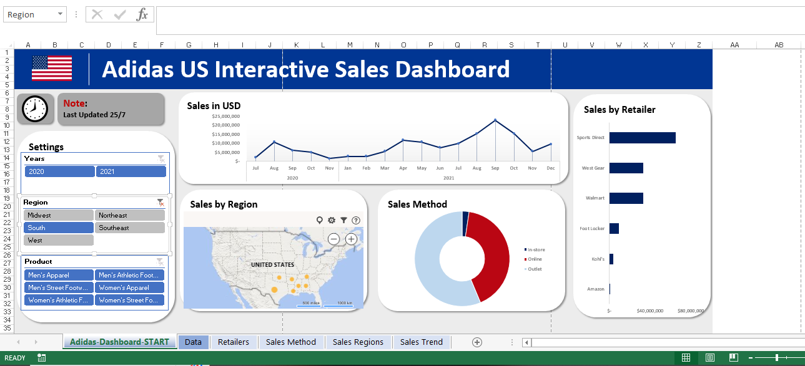

# John Adoga
#### Data & Analytics Analyst. Visualization Expert. Business Analyst. Financial Analyst. Day Trader (Currencies, Equities, Gold). Human Resource Manager
![Data & Analytics Analyst. Visualization Expert. Business Analyst. Financial Analyst. Day Trader (Currencies, Equities, Gold). Human Resource Manager]

I’m John Adoga from Nigeria, As a seasoned Data Analyst, I have honed my ability to transform raw data into actionable insights. I’m adept at utilizing a range of tools and methodologies to derive meaningful conclusions that drive business & financial decisions. My proficiency in statistical analysis, predictive modeling, and data visualization ensures that the narratives hidden within numbers are effectively communicated to stakeholders.

## Skills and Experience 
EXCEL, GOOGLE SHEETS, PYTHON, SQL, R, GOOGLE LOCKER STUDIO, POWER BI, TABLEAU

- 🔭 I’m currently working on A lot of projects... 
- 🌱 I’m currently learning German 

          

# [Project 1: Exodus Cinema Popcorn Feedback Survey](https://janalytics00.github.io/John_port/Exodus-Cinema-Popcorn-Feedback-Survey)

Overview:
Undertook a comprehensive survey project for Exodus Cinemas aimed at gathering customer feedback regarding the popcorn served at the venue. The primary objective was to understand customer preferences, identify areas of improvement, and align the popcorn quality and variety with audience expectations.

Key Components:

Survey Design: Crafted a set of strategic questions that delved into aspects like taste, freshness, portion size, variety, and price of the popcorn.
Data Collection: Employed both digital and on-site survey methods to capture a diverse range of audience feedback.
Data Analysis: Analyzed the collected data to identify prevailing trends, satisfaction levels, and areas needing attention.
Recommendations: Based on the analysis, provide actionable recommendations to enhance the popcorn's quality, introduce new flavors, adjust pricing, or modify serving sizes.

## Overview of the project 

# [Project 2: Adidas US Interactive Sales Dashboard](https://janalytics00.github.io/John_port/Adidas-US-Interactive-Sales-Dashboard)

Overview:
Designed and developed an interactive sales dashboard focused on Adidas US market performance. This dynamic tool visualizes real-time sales data, highlighting key metrics like regional sales, top-performing products, and monthly trends. By incorporating user-responsive features, stakeholders can easily customize views, allowing for intuitive, data-driven decision-making. The dashboard offers a cohesive snapshot of Adidas' market positioning and areas of growth, serving as an invaluable tool for strategists and marketers.

## Overview of the project 

# [Project 3: A Bike Sales Dashboard crafted in Excel!]([https://janalytics00.github.io/John_port/Adidas-US-Interactive-Sales-Dashboard](https://www.linkedin.com/posts/john-adoga-6830071a3_dataanalytics-exceldashboard-bikesalesanalysis-activity-7112398062555213824-aNix?utm_source=share&utm_medium=member_desktop))

🚴‍♂️ Exciting Project Alert! 📊

Delighted to share my latest creation: A Bike Sales Dashboard crafted in Excel! This interactive tool provides a deep dive into bike sales across regions - Europe, North America, and the Pacific. But what makes it even more intriguing is the layering of data by educational qualification, age ranges, and marital status. Ever wondered who's pedaling more, singles or married folks? Or which age bracket is the most bicycle-inclined?

With this dashboard, you can visualize these trends at a glance! Proud of this endeavor, as it not only hones my analytical skills but also offers invaluable insights for targeted marketing and sales strategies.

Would love to hear your feedback and thoughts! Let's pedal forward with data-driven insights. 🚴‍♀️📈

## Overview of the project ![][(https://github.com/Janalytics00/John_port/blob/main/assest/2023-09-26_03-21-46.png)](https://github.com/Janalytics00/John_port/blob/main/assest/2023-09-26_03-21-46.png)

# [Project 4: Data cleaning in Excel and Google Sheets]

Overview:
Engaged in a comprehensive data cleaning initiative utilizing both Excel and Google Sheets to enhance the quality and integrity of a significant dataset. The project entailed identifying and rectifying discrepancies, missing values, and potential outliers, ensuring consistency and uniformity across.

**## Overview of the project **
